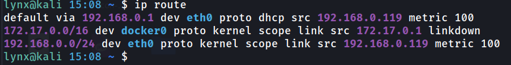
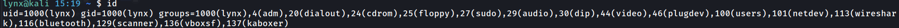
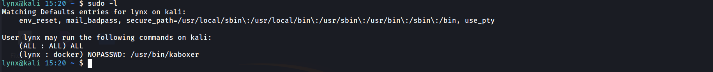
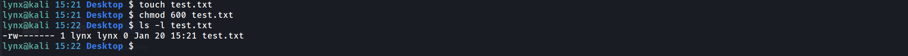
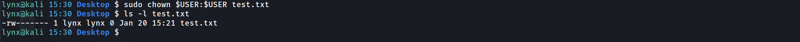
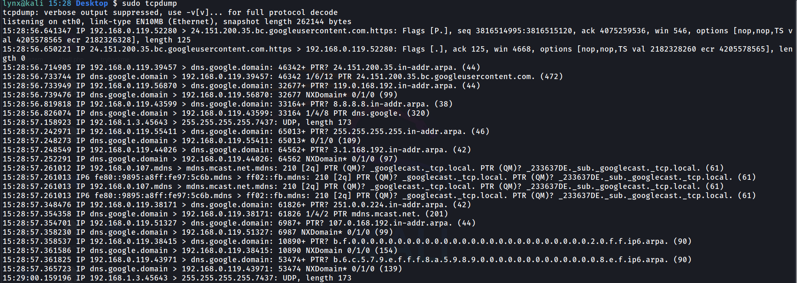

# Linux Commands

## 1. ip a
Displays network interfaces and IP addresses.
Used to identify system network configuration.

## 2. ip route
Shows the routing table.
Used to understand how packets leave the system.

## 3. ss -tulnp
Lists all listening ports and services.
Used to identify open ports and running services.

## 4. netstat -tulnp
Shows active connections and listening services.
Helpful for detecting unauthorized services.

## 5. ps aux
Displays all running processes.
Used to identify suspicious or malicious processes.

## 6. top
Shows real-time system resource usage.
Used to monitor abnormal CPU or memory usage.

## 7. whoami
Displays the current user.
Used to verify privilege level.

## 8. id
Shows user ID and group memberships.
Used to check permission and access levels.

## 9. sudo -l
Lists commands the user can run with sudo.
Used during privilege escalation checks.

## 10. chmod
Changes file permissions.
Used to secure or exploit file access.

## 11. chown
Changes file ownership.
Used to control access to sensitive files.

## 12. find / -perm -4000 2>/dev/null
Finds SUID binaries on the system.
Used for privilege escalation analysis.

## 13. grep
Searches for specific patterns in files.
Used to find credentials or logs.

## 14. journalctl
Displays system logs.
Used for incident response and log analysis.

## 15. tcpdump
Captures network packets.
Used for traffic analysis and investigation.
