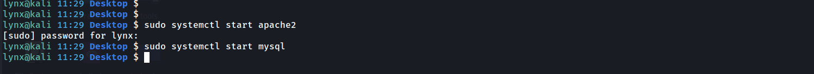
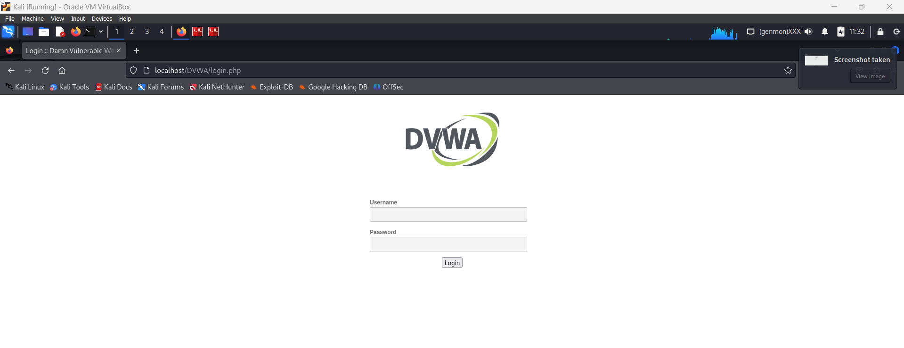
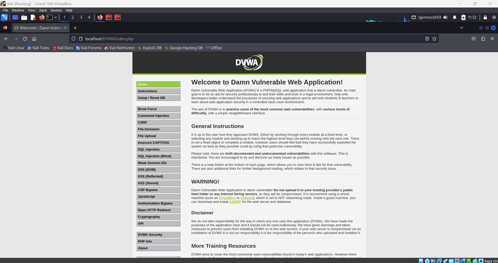

# Vulnerable Lab Setup & Proof

## 1. OWASP Juice Shop

OWASP Juice Shop is a deliberately insecure web application used to practice web security testing. This setup demonstrates running it locally using Docker.


- **Method:** Docker container  
- **Docker Image:** `bkimminich/juice-shop` (official image from Docker Hub)  
- **Port Mapping:** 3000 → 3000 (host → container)  
- **Access URL:** [http://localhost:3000](http://localhost:3000)  
- **Commands used:**
```bash
# Create and run a new container
sudo docker run -d -p 3000:3000 --name juice-shop bkimminich/juice-shop

# Start the Juice Shop container if it already exists
sudo docker start juice-shop
```

### Screenshots

**Terminal running Docker:**  


**Juice Shop Homepage:**  


---

## 2. DVWA (Damn Vulnerable Web Application)

DVWA is a PHP/MySQL web application intentionally designed with vulnerabilities for learning and practicing web security testing.


- **Method:** Localhost setup using Apache + MySQL  
- **Platform:** Apache + MySQL (on Linux)  
- **Directory:** `/var/www/html/dvwa`  
- **Access URL:** [http://localhost/dvwa](http://localhost/dvwa)  
- **Database:** MySQL database created during initial DVWA setup  

### Commands / Steps

1. Start Apache and MySQL services:  
```bash
sudo systemctl start apache2
sudo systemctl start mysql
```

2. Open browser and go to:[http://localhost/dvwa](http://localhost/dvwa)  

3. Login using default credentials:
Username: admin
Password: password

4. DVWA homepage should load successfully

### Screenshots

**1. Terminal: Starting Apache2 & MySQL**  



**2. DVWA Login Page** 



**3. DVWA Homepage**


