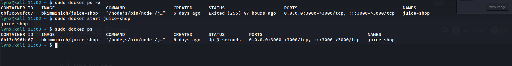
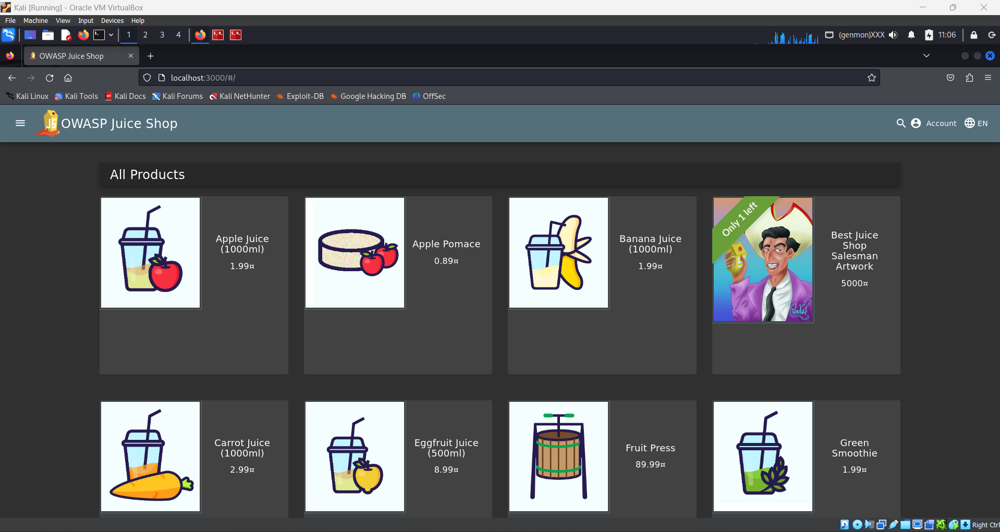

# Vulnerable Lab Setup & Proof

## 1. OWASP Juice Shop

OWASP Juice Shop is a deliberately insecure web application used to practice web security testing. This setup demonstrates running it locally using Docker.


- **Method:** Docker container  
- **Docker Image:** `bkimminich/juice-shop` (official image from Docker Hub)  
- **Port Mapping:** 3000 → 3000 (host → container)  
- **Access URL:** [http://localhost:3000](http://localhost:3000)  
- **Commands used:**
```bash
# Create and run a new container
sudo docker run -d -p 3000:3000 --name juice-shop bkimminich/juice-shop

# Start the Juice Shop container if it already exists
sudo docker start juice-shop
```

### Screenshots

**Terminal running Docker:**  


**Juice Shop Homepage:**  

