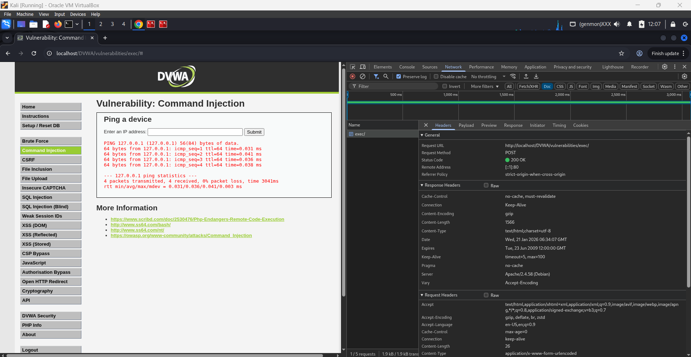

# Chrome DevTools – HTTP Request Capture

## 1. Login Request

- **URL:** [http://localhost/DVWA/login.php](http://localhost/DVWA/login.php)
- **Method:** GET
- **Parameters:**
  - username
  - password
  - Login
- **Observation:**
  - Login data is sent using the GET method.
  - Server responds with HTTP 200 and returns an HTML page.
  - Successful authentication results in a session being created using a PHP session ID cookie.

## 2. Form Request 

- **URL:** [http://localhost/DVWA/vulnerabilities/exec/](http://localhost/DVWA/vulnerabilities/exec/)
- **Method:** POST
- **Parameters (Form Data):**
  - ip = 127.0.0.1
  - Submit = Submit
- **Observation:**
  - Form data is sent using the POST method with `application/x-www-form-urlencoded` encoding.
  - User input is processed by the `exec` endpoint on the server.
  - Server responds with HTTP 200 and executes system commands based on the supplied input.
  - Session is maintained using a PHP session ID cookie.
