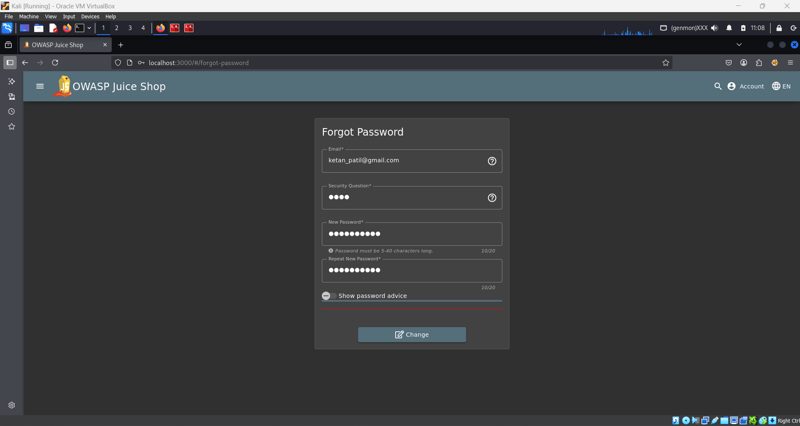
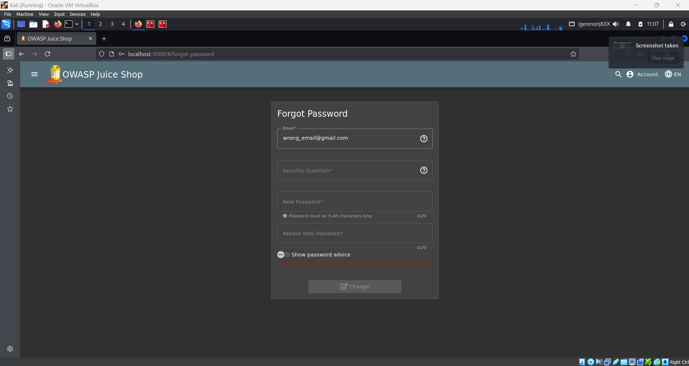

# Security Notes: Web Application Testing

## Scope
This note documents observations and analysis of potential security issues within a web application, focusing on areas where client-side behavior could expose sensitive information or allow unauthorized actions. The goal is to capture relevant findings for review, learning, and future reference.

## Target
- Web application password reset functionality  
- Client-side form behavior  
- Different user account scenarios:
  - **Valid email accounts**  
  - **Invalid/non-existent email accounts**  

## Observations
- Entering a **valid email** immediately enables the following fields:
  - Security question  
  - New password  
  - Confirm password

- Entering an **invalid email** keeps these fields **disabled**, preventing interaction.

- The difference in behavior occurs **instantly on the client side**, without submitting the form.
- No explicit server-side error messages are required to identify valid accounts. The **UI state itself leaks information**, demonstrating a subtle **user enumeration vulnerability**.
- This type of client-side information leakage could be exploited by attackers to:
  - Identify registered users quickly  
  - Launch targeted phishing or social engineering attacks  
  - Prepare for credential stuffing or account takeover attempts

## Questions
- Could this client-side user enumeration be combined with other attack vectors, such as phishing or credential stuffing?  
- Are there other parts of the web application where front-end behavior exposes sensitive information?  
- How could **uniform server responses, rate limiting, or CAPTCHAs** mitigate this vulnerability?  
- What additional steps could be taken to prevent **side-channel leaks** in web applications?  

## Learning
- Even front-end behavior can inadvertently **leak sensitive information**, even if server-side logic is secure.  
- User enumeration does not require explicit error messages; **UI state changes can serve as a side channel**.  
- Structured note-taking using headings helps track vulnerabilities, observations, questions, and lessons learned in a **professional, clear manner**.  
- Documenting observations in **clean Markdown format** improves readability, reproducibility, and reviewability.  
- Small, detailed notes like these can later support **formal reports or presentations**, bridging practical testing with documentation skills.
