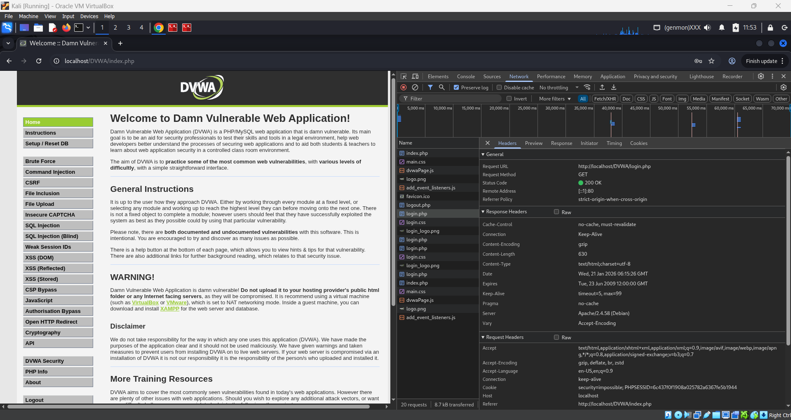

# Tool User vs Skill Builder – Mindset Analysis

## Action: Chrome DevTools Network Analysis (Login & Form Requests)

### Evidence (Chrome DevTools)

**Login Request (Network Tab):**  

**Form Submission Request:**  

### Understanding Without Relying on 

Before using Chrome DevTools, I already understood certain fundamentals of how web applications communicate:
- Web applications use HTTP requests and responses to communicate between client and server.
- Login forms and input forms typically send data using GET or POST methods.
- Parameters such as usernames, passwords, or user input are passed through URLs, query strings, or request bodies.
- Authentication often results in the creation of a session, usually managed through cookies like PHPSESSID.
- Poor handling of requests or parameters can lead to vulnerabilities such as credential exposure or injection flaws.

Even without DevTools, by understanding HTTP and application flow, I could reason about:
- What endpoint would likely handle a login request
- Which inputs are being sent to the server
- Whether sensitive data should or should not appear in the URL
- How sessions persist after authentication

### What the Tool Made Faster and Clearer

Chrome DevTools significantly reduced the effort required to validate and observe these behaviors in real time:
- It showed the exact request URL, method, and headers without guessing.
- It clearly displayed parameters and payloads sent during login and form submission.
- It allowed inspection of cookies, confirming session creation and persistence.
- It provided immediate visibility into server responses, status codes, and content types.
- It helped correlate user actions in the browser directly with network activity.
- Instead of manually reasoning or inferring behavior, DevTools provided direct evidence and reduced time-to-analysis.

### Core Takeaway

This exercise reinforced that tools do not replace understanding — they amplify it.
A tool user relies on DevTools to tell them what is happening.
A skill builder already understands why it is happening and uses tools only to confirm, document, and speed up the process.

In real-world security work, strong fundamentals allow an analyst to:
- Ask the right questions
- Interpret tool output correctly
- Avoid false assumptions
- Communicate findings clearly
Tools make analysis faster, but understanding makes it meaningful.