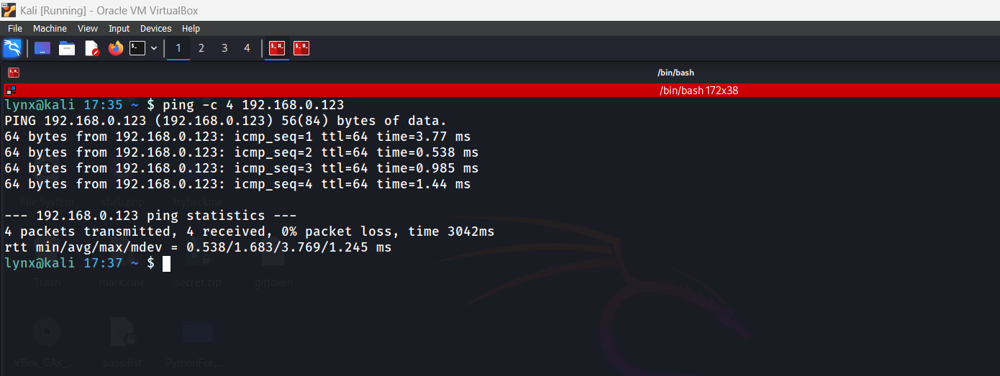
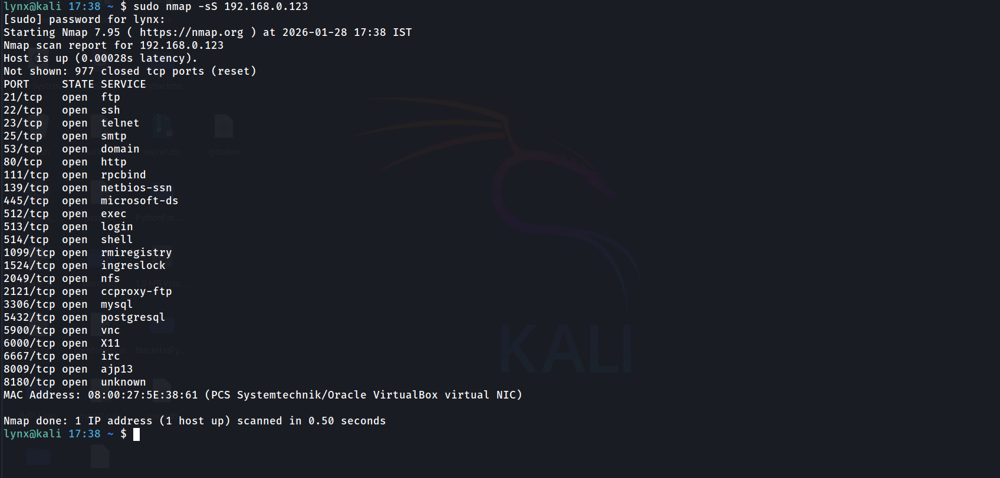
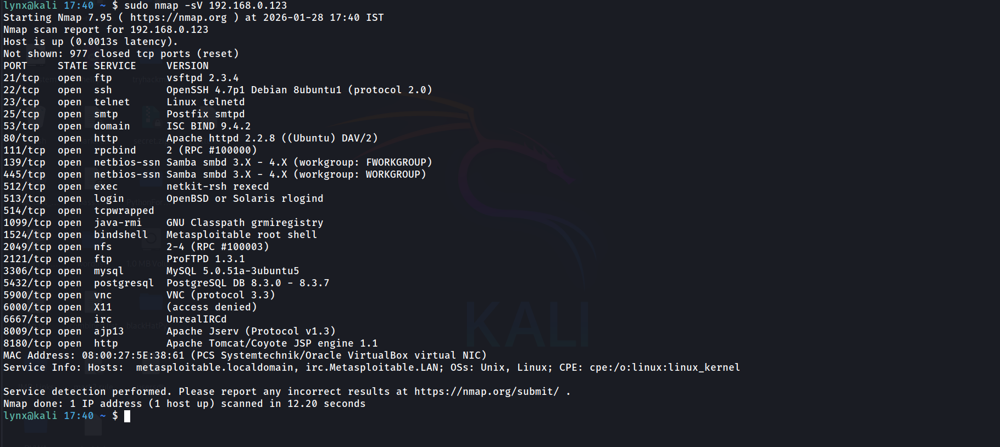
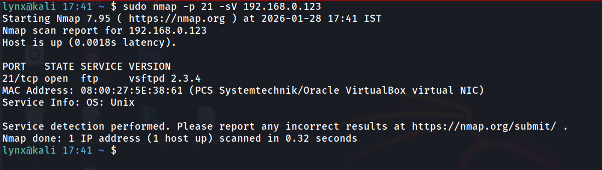

# Pentester Workflow Simulation – Metasploitable

## Environment
- Attacker Machine: Kali Linux
- Target Machine: Metasploitable2
- Network: Local lab environment (isolated test setup)
- Objective: Reconnaissance and service analysis without exploitation

---

## Step 1: Observe

Initial observation revealed the following about the target environment:
- The Metasploitable host was reachable from the Kali attacker machine
- Both systems were present on the same network segment
- The target responded consistently to ICMP requests
- No immediate network-level filtering or connectivity issues were observed
These observations confirmed that the target was accessible and suitable for further reconnaissance activities.

---

## Step 2: Identify Attack Surface

The following attack surface was identified on the target system:
- Multiple TCP ports were found open, indicating a broad exposed service footprint
- Common services such as FTP, SSH, and HTTP were accessible from the network
- Several legacy-style services were present, increasing the likelihood of misconfiguration or outdated software
- Each open port represented a potential entry point depending on service behavior and versioning
At this stage, only exposure was identified. No conclusions were drawn about vulnerability or exploitability, as the presence of a service alone does not imply risk.

---

## Step 3: Analyze Services

Analysis of exposed services revealed the following characteristics:
- Specific service versions were identifiable for multiple open ports
- Several services were found running versions that are outdated or rarely seen in modern deployments
- Legacy service versions typically carry a higher risk due to publicly known weaknesses and lack of ongoing maintenance
- The combination of service exposure and version age narrowed the focus to higher‑risk components
At this stage, risk was assessed based on exposure and versioning only. No exploitation or vulnerability confirmation was performed.

---

## Step 4: Focus on a Risky Service

One exposed service was prioritized for deeper analysis based on risk indicators identified earlier.
- The service was accessible from the network without additional restrictions
- Version information indicated a legacy or potentially outdated implementation
- Public exposure combined with version age increased its risk profile compared to other services
- Focusing on a single service allowed controlled and methodical assessment without expanding scope unnecessarily
This prioritization reflects real-world penetration testing practices, where risk-based decision making guides deeper investigation.

---

## Step 5: Findings

Based on reconnaissance and service analysis, the following security-relevant observations were identified:
- The target system exposes multiple network services simultaneously, increasing the overall attack surface
- Several services appear outdated or legacy in nature, which may increase risk if known vulnerabilities exist
- Critical services such as FTP, SSH, and HTTP are accessible without additional network-level restrictions
- The combination of service exposure and version information suggests a higher likelihood of misconfiguration or known weaknesses
These findings were documented with supporting evidence, including port scan results and service version details. No exploitation was performed, as the objective was to assess exposure and risk at the reconnaissance stage.