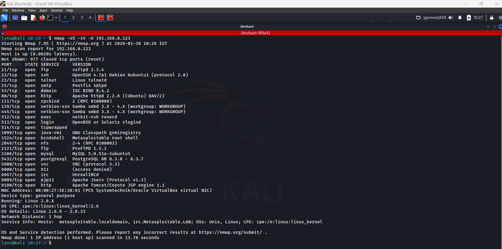

# Metasploitable Port Scanning and Risk Analysis Report

## Objective
- To scan the Metasploitable machine using Nmap
- To determine the number of open ports
- To identify risky services
- To analyze outdated service versions exposed on the target system

---

## Target and Scan Details
- Target Machine: Metasploitable
- Target IP Address: 192.168.0.123
- Scanning Machine: Kali Linux
- Tool Used: Nmap
- Scan Command:
  - `nmap -sS -sV -O 192.168.0.123`

---

## Open Ports Analysis
- Total number of open TCP ports detected: **23**
- The system exposes a large attack surface due to multiple unnecessary services running simultaneously
- Most services are accessible without any network restrictions

---

## Open Ports Identified
- Port 21: FTP
- Port 22: SSH
- Port 23: Telnet
- Port 25: SMTP
- Port 53: DNS
- Port 80: HTTP
- Port 111: RPC
- Port 139: SMB
- Port 445: SMB
- Port 512: exec
- Port 513: login (rlogin)
- Port 514: shell (rsh)
- Port 1099: Java RMI
- Port 1524: Bind shell
- Port 2049: NFS
- Port 2121: FTP
- Port 3306: MySQL
- Port 5432: PostgreSQL
- Port 5900: VNC
- Port 6000: X11
- Port 6667: IRC
- Port 8009: AJP
- Port 8180: HTTP (Tomcat)

---

## Risky Services Identified
- FTP services:
  - Multiple FTP services running increase exposure
  - Common target for brute-force and backdoor attacks
- Telnet service:
  - Transmits credentials in plaintext
  - Highly insecure and deprecated
- Samba (SMB) services:
  - Known history of remote code execution vulnerabilities
- Bind shell on port 1524:
  - Provides direct root-level shell access
  - Extremely critical security risk
- Java RMI service:
  - Can be abused for remote code execution
- NFS service:
  - May expose sensitive files if misconfigured
- IRC service:
  - Known to contain backdoored versions
- Apache Tomcat service:
  - Often misconfigured with default credentials

---

## Outdated Service Versions
- vsftpd 2.3.4:
  - Known backdoor vulnerability
- OpenSSH 4.7p1:
  - Outdated and vulnerable to legacy cryptographic weaknesses
- ISC BIND 9.4.2:
  - Multiple historical DNS vulnerabilities
- Apache HTTP Server 2.2.8:
  - End-of-life version with known security flaws
- Samba smbd 3.x:
  - Vulnerable to remote exploits
- ProFTPD 1.3.1:
  - Susceptible to authentication and command execution vulnerabilities
- MySQL 5.0.51a:
  - Deprecated version with known privilege escalation issues
- PostgreSQL 8.3.x:
  - End-of-life database version
- UnrealIRCd:
  - Known backdoored release allowing command execution
- Linux Kernel 2.6.x:
  - Contains multiple unpatched vulnerabilities

---

- The Metasploitable machine exposes **23 open ports**, significantly increasing its attack surface
- Several services are both **risky and outdated**, making the system highly vulnerable
- This scan demonstrates the importance of service hardening, patch management, and minimizing exposed services
- Such reconnaissance is a critical first step in real-world penetration testing
