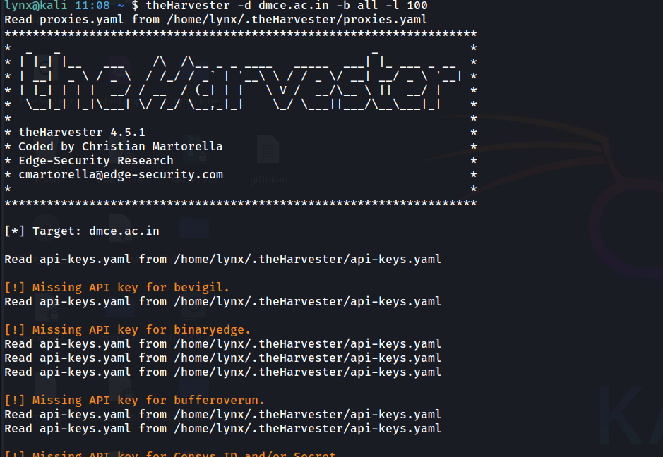

# theHarvester OSINT Reconnaissance Report

## Target Domain
- **dmce.ac.in**

---

## Tool Used
- **theHarvester v4.5.1**

---

## Command Executed
```bash
theHarvester -d dmce.ac.in -b all -l 100
```


## Objective
To perform passive OSINT reconnaissance on the target domain to identify publicly available:
- Subdomains
- Email addresses
- Infrastructure-related information

---

### Findings


### ASN Information
- **AS Number Found:** AS16509

---

### IP Addresses Discovered
- **76.76.21.22**

---

### Emails Discovered
- **principal@dmce.ac.in**


---

### Subdomains / Hosts Discovered
A total of **62 subdomains/hosts** were identified.

- backup.dmce.ac.in  
- backup.dmce.ac.in:58.68.58.132  
- codeathon.dmce.ac.in  
- codeathons.dmce.ac.in  
- cpanel.dmce.ac.in  
- cpcalendars.dmce.ac.in  
- cpcontacts.dmce.ac.in  
- csi.dmce.ac.in  
- dmcegits.dmce.ac.in  
- ecell.dmce.ac.in  
- email.dmce.ac.in  
- email1.dmce.ac.in  
- email2.dmce.ac.in  
- gdsc.dmce.ac.in  
- gits.dmce.ac.in  
- iete.dmce.ac.in  
- iste.dmce.ac.in  
- mail.dmce.ac.in  
- moodle.dmce.ac.in  
- services.dmce.ac.in  
- techotsav.dmce.ac.in  
- webdisk.dmce.ac.in  
- webmail.dmce.ac.in  
- www3.gits.dmce.ac.in  
- wwwc.csi.dmce.ac.in  

Several subdomains were observed resolving to internal IP addresses and external services such as Google mail servers.


---

## Observations
- The target domain exposes a large number of subdomains, indicating a wide digital footprint.
- Administrative and service-related subdomains such as `cpanel`, `webmail`, and `webdisk` were publicly discoverable.
- An official email address was exposed through OSINT techniques, which could be misused for phishing or social engineering.
- Some data sources could not be queried due to missing API keys; however, sufficient information was gathered using open sources.
- The reconnaissance was fully passive and did not involve active scanning or exploitation.
