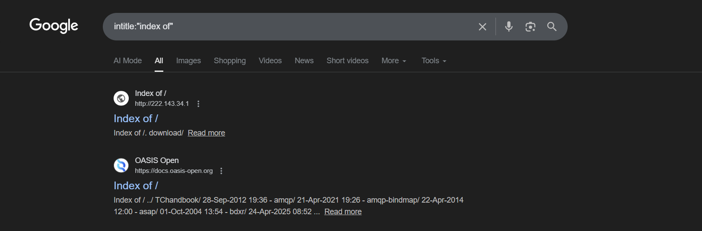
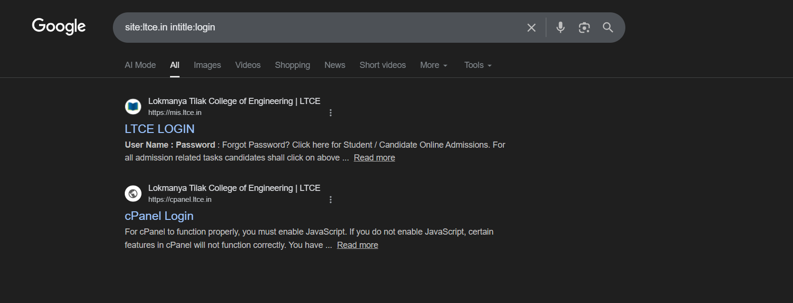

# Google Dorking – Information Exposure Discovery

## Objective
To identify publicly accessible files, exposed directories, and login pages using Google Dorks, and to understand the type of information that could be unintentionally exposed through search engines.

---

## Scope
- Passive reconnaissance
- No interaction with target systems
- No exploitation performed

## 1. Public Files Discovery

### Google Dorks Used
```bash
site:ltce.in filetype:pdf
site:ltce.in filetype:xls OR filetype:xlsx
site:ltce.in filetype:doc OR filetype:docx
```

### Information Exposed
- Internal reports or documentation
- Employee or client data stored in spreadsheets
- Configuration details embedded within documents
- Metadata revealing usernames, software versions, or internal file paths

### Observation
Documents indexed by search engines may expose sensitive internal information that was never intended for public access.


---

## 2️. Exposed Directories


### Google Dorks Used
```bash
intitle:"index of"
"parent directory"
```

### Information Exposed
- Backup files
- Source code archives
- Older or deprecated application versions
- Log files or temporary files

### Observation
Exposed directory listings can reveal internal file structures, making it easier for attackers to locate sensitive or misconfigured resources.



---

## 3️. Login Pages Discovery

### Google Dorks Used
```bash
site:ltce.in inurl:login
site:ltce.in intitle:"login"
site:ltce.in inurl:admin
```

### Information Exposed
- Authentication endpoints
- Administrative or management interfaces
- Technology stack indicators (CMS, frameworks, platforms)

### Observation
While login pages are not vulnerabilities by themselves, publicly discoverable authentication endpoints increase the attack surface and enable targeted attacks such as brute-force or credential stuffing.



---

## Key Takeaways

- Google Dorking allows attackers to discover sensitive information without directly interacting with the target
- Misconfigured servers and weak access controls often lead to unintended data exposure
- Passive reconnaissance is commonly the first step in real-world attacks
- Proper access controls and search engine restrictions (e.g., authentication, indexing rules) are essential for reducing exposure

