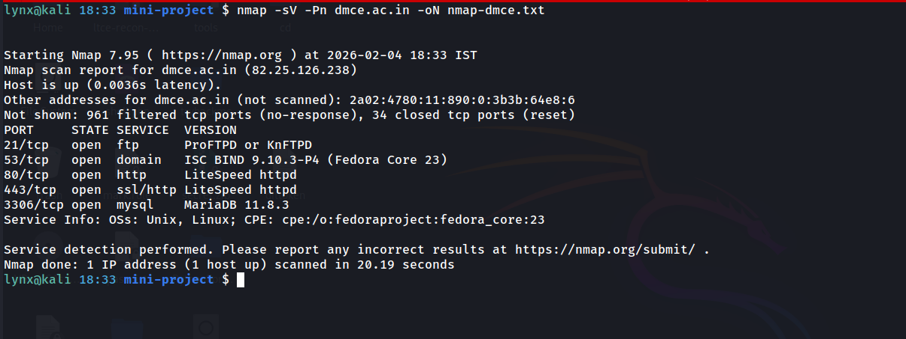

# Nmap Scan Report

## Target Information
- **Domain:** dmce.ac.in
- **Resolved IP Address:** 82.25.126.238
- **Scan Date:** 2026-02-04
- **Tool Used:** Nmap 7.95

## Scan Objective
To identify publicly exposed network services and open ports as part of the reconnaissance phase for asset inventory.

## Scan Methodology
A limited service and version detection scan was performed to enumerate open TCP ports and identify running services without intrusive techniques.

### Command Executed
```bash
nmap -sV -Pn dmce.ac.in -oN nmap-dmce.txt
```



## Host Status
Host is up and reachable
Latency observed: 0.0036 seconds

## Scan Summary
Open Ports Identified: 5
Filtered Ports: 961 TCP ports
Closed Ports: 34 TCP ports

## Open Ports and Services
- 21/tcp – FTP
Service detected: ProFTPD or KnFTPD
- 53/tcp – DNS
Service detected: ISC BIND 9.10.3-P4 (Fedora Core 23)
- 80/tcp – HTTP
Service detected: LiteSpeed httpd
- 443/tcp – HTTPS
Service detected: LiteSpeed httpd
- 3306/tcp – MySQL
Service detected: MariaDB 11.8.3

## Service Observations

- FTP service (Port 21) is publicly accessible, which may increase exposure if misconfigured.
- DNS service (Port 53) is running ISC BIND and reveals version information.
- HTTP and HTTPS services are served using the LiteSpeed web server.
- Database service (MySQL/MariaDB) is accessible on port 3306, indicating potential external exposure.
- Service fingerprinting suggests the system is running on a Linux/Unix-based platform.

## OS and Platform Information
Operating System Family: Unix / Linux
Detected CPE: Fedora Core 23