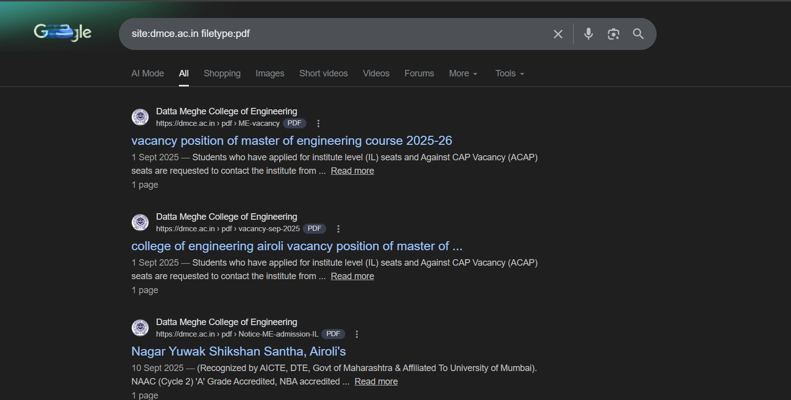
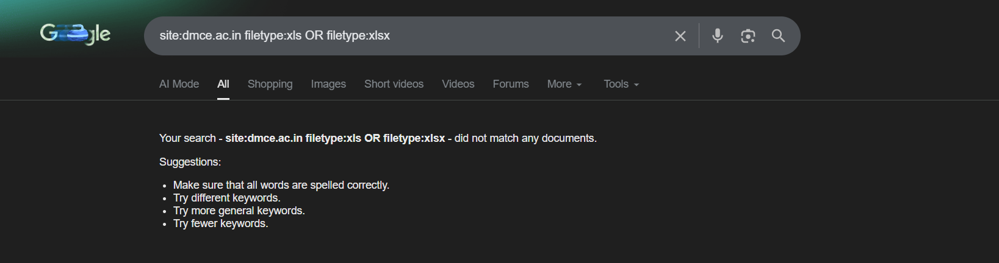
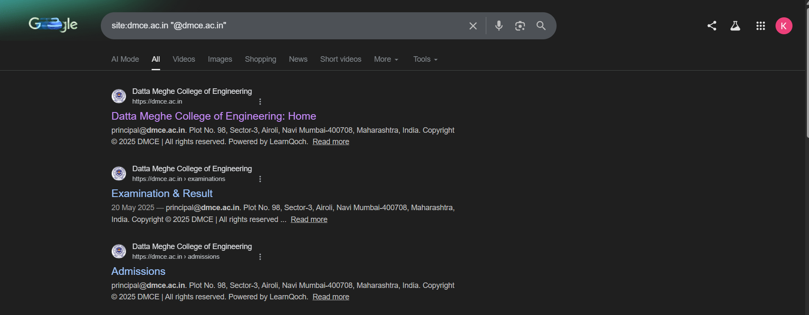
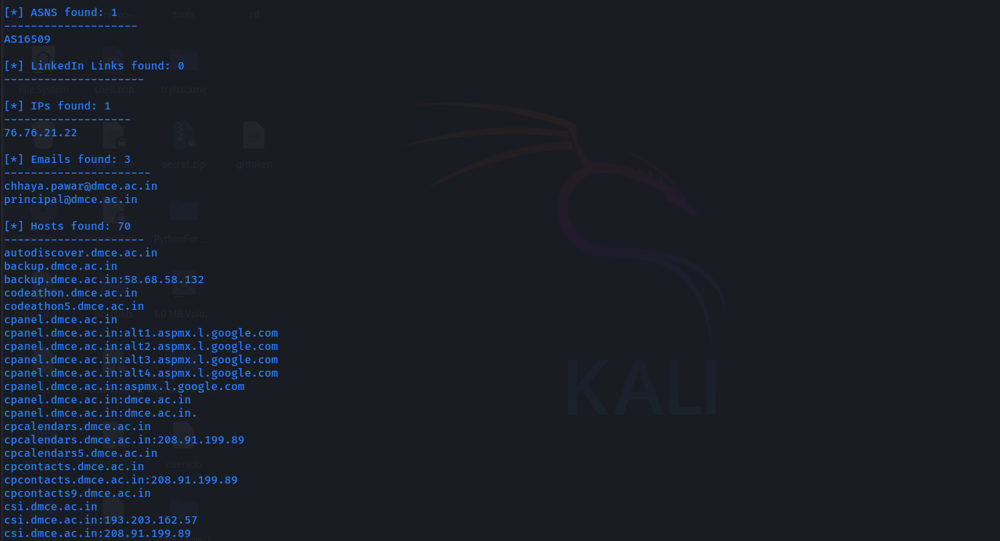
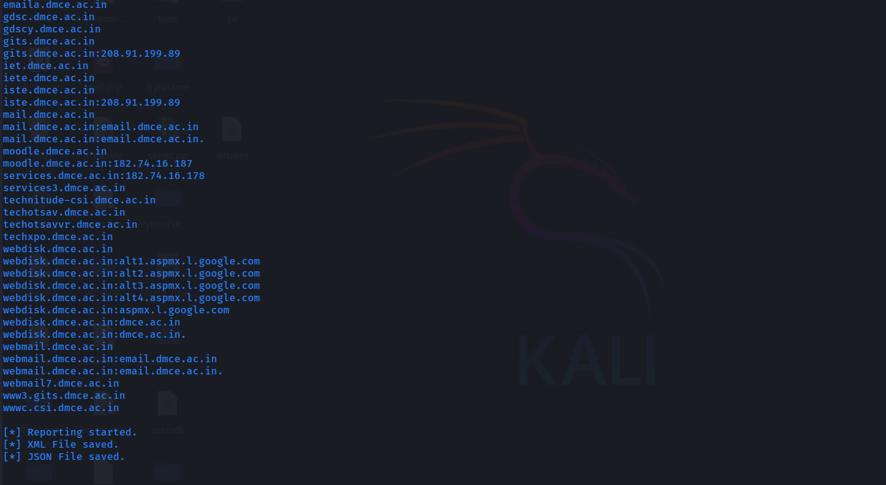

# OSINT Findings Report

## Objective
To collect publicly available information related to `dmce.ac.in` using passive OSINT techniques in order to identify exposed documents, email addresses, and infrastructure-related assets.

## Target
- **Domain:** dmce.ac.in  
- **Organization:** Datta Meghe College of Engineering  
- **Category:** Educational Institution  

## Methodology
Passive OSINT techniques were used without performing any active scanning or exploitation.
- Google Search Operators (Google Dorks)
- Automated passive enumeration using theHarvester
- Manual analysis of publicly indexed results

## Tools Used
- Google Search
- theHarvester
- Web Browser

---

## Google Dorks Findings

### Publicly Accessible PDF Documents
```bash
site:dmce.ac.in filetype:pdf
```

- Multiple institutional PDF documents are publicly indexed.
- Documents include admission notices, vacancy positions, NAAC accreditation files, and event reports.
- Several documents expose official email addresses and internal institutional information.

**Documents Identified**
- ME Vacancy Position (2025–26)
- Admission Schedules
- NAAC Criterion Reports
- Seminar and Event Reports (2019–2021)



---

### Public Spreadsheet Files
```bash
site:dmce.ac.in filetype:xls OR filetype:xlsx
```

- No publicly indexed Excel or spreadsheet files were found.
- Indicates comparatively better control over spreadsheet exposure.




---

### Publicly Indexed Email Addresses
```bash
site:dmce.ac.in "@dmce.ac.in"
```

- Multiple official email addresses are publicly visible across various pages.
- principal@dmce.ac.in  
- student.section@dmce.ac.in  



---

## theHarvester 

**Command**
```bash
theHarvester -d dmce.ac.in -b all -f theharvester-dmce
```

## theHarvester Findings

### Email Addresses Identified
- chhaya.pawar@dmce.ac.in
- principal@dmce.ac.in
These email addresses appear to belong to administrative or faculty personnel.

### Hosts / Subdomains Identified
- www.dmce.ac.in
- mail.dmce.ac.in
- webmail.dmce.ac.in
- cpanel.dmce.ac.in
- webdisk.dmce.ac.in
- moodle.dmce.ac.in
- dmce-placement.dmce.ac.in
- ecell.dmce.ac.in
- csi.dmce.ac.in
- gdsc.dmce.ac.in
- iste.dmce.ac.in
- gits.dmce.ac.in
- techotsav.dmce.ac.in
- techxpo.dmce.ac.in
- backup.dmce.ac.in

### IP Addresses Observed
- 82.25.126.238
- 182.74.16.187
- 182.74.16.180
- 208.91.199.89

These IPs correspond to hosting infrastructure and service endpoints used by the organization.




