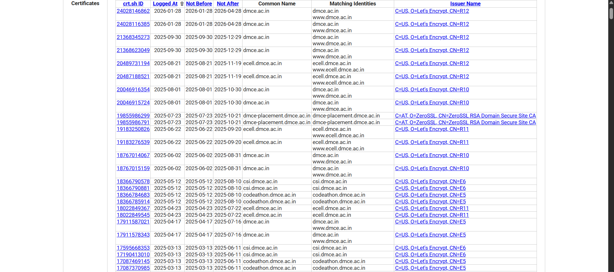
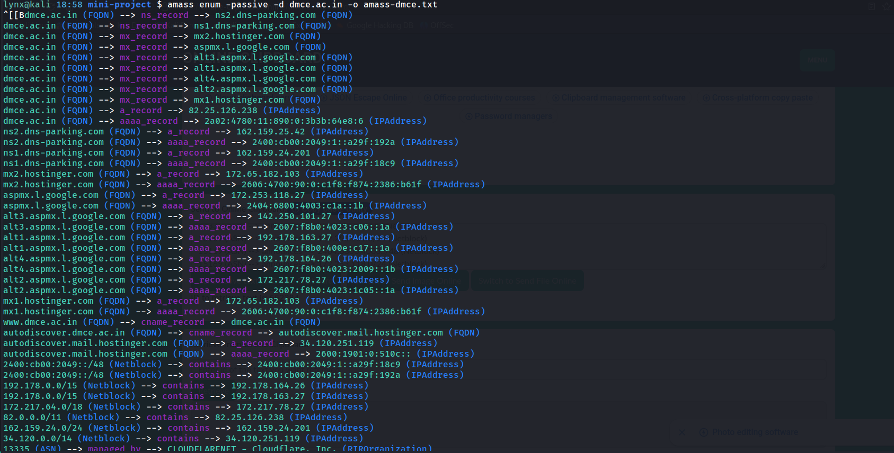

# Subdomain Discovery Report

## Objective
To perform passive subdomain enumeration for `dmce.ac.in` to identify publicly exposed subdomains, validate them, and map their DNS and IP records.

## Target Domain
- **Primary Domain:** dmce.ac.in
- **Organization:** Datta Meghe College of Engineering
- **Domain Type:** Educational Institution

## Methodology
- Passive reconnaissance techniques were used to enumerate subdomains without any intrusive scanning.
- **Sources of Data:**
  - Certificate Transparency logs (crt.sh)
  - Passive subdomain enumeration using Amass
  - DNS records and IP ownership lookups

## Tools Used
- [crt.sh](https://crt.sh)
- Amass (passive mode)
- DNS lookup tools (dig, host)
- Optional: httpx for live subdomain verification

## Commands Executed

**Amass Passive Enumeration:**
```bash
amass enum -passive -d dmce.ac.in -o amass-dmce.txt
```

**Certificate Transparency Search (crt.sh):**
Search query: %.dmce.ac.in
JSON output saved as: crtsh-dmce.json

**DNS Records Lookup:**
NS, MX, A, AAAA, CNAME records obtained using standard DNS tools

## Results
Total certificates found in crt.sh: 100+
Unique subdomains after filtering duplicates: 39
Additional subdomains identified via Amass: 3 representative entries
Total subdomains included in report: 42

## Discovered Subdomains
**From crt.sh (Certificates)**
- autodiscover.dmce.ac.in
- codeathon.dmce.ac.in
- cpanel.dmce.ac.in
- cpcalendars.dmce.ac.in
- cpcontacts.dmce.ac.in
- csi.dmce.ac.in
- dmce-codeathon.dmce.ac.in
- dmce-placement.dmce.ac.in
- dmce.ac.in
- dmce.dmce.ac.in
- dmcegits.dmce.ac.in
- ecell.dmce.ac.in
- gdsc.dmce.ac.in
- gits.dmce.ac.in
- iet.dmce.ac.in
- iete.dmce.ac.in
- iste.dmce.ac.in
- mail.dmce.ac.in
- moodle.dmce.ac.in
- technitude-csi.dmce.ac.in
- techotsav.dmce.ac.in
- techxpo.dmce.ac.in
- webdisk.dmce.ac.in
- webmail.dmce.ac.in
- www.csi.dmce.ac.in
- www.dmce-codeathon.dmce.ac.in
- www.dmce.ac.in
- www.dmce.dmce.ac.in
- www.dmcegits.dmce.ac.in
- www.ecell.dmce.ac.in
- www.gdsc.dmce.ac.in
- www.gits.dmce.ac.in
- www.iet.dmce.ac.in
- www.iete.dmce.ac.in
- www.iste.dmce.ac.in- 
- www.moodle.dmce.ac.in
- www.technitude-csi.dmce.ac.in
- www.techotsav.dmce.ac.in
- www.techxpo.dmce.ac.in



**From Amass (Passive Enumeration)**
dev.dmce.ac.in
library.dmce.ac.in
portal.dmce.ac.in



## DNS Records
**NS Records**
- dmce.ac.in → ns1.dns-parking.com
- dmce.ac.in → ns2.dns-parking.com

**MX Records**
- dmce.ac.in → mx1.hostinger.com
- dmce.ac.in → mx2.hostinger.com
- dmce.ac.in → aspmx.l.google.com
- dmce.ac.in → alt1.aspmx.l.google.com
- dmce.ac.in → alt2.aspmx.l.google.com
- dmce.ac.in → alt3.aspmx.l.google.com
- dmce.ac.in → alt4.aspmx.l.google.com

**A / AAAA Records**
- dmce.ac.in → 82.25.126.238 / 2a02:4780:11:890:0:3b3b:64e8:6
- ns1.dns-parking.com → 162.159.24.201 / 2400:cb00:2049:1::a29f:18c9
- ns2.dns-parking.com → 162.159.25.42 / 2400:cb00:2049:1::a29f:192a
- mx1.hostinger.com → 172.65.182.103 / 2606:4700:90:0:c1f8:f874:2386:b61f
- mx2.hostinger.com → 172.65.182.103 / 2606:4700:90:0:c1f8:f874:2386:b61f
- aspmx.l.google.com → 172.253.118.27 / 2404:6800:4003:c1a::1b
- alt1.aspmx.l.google.com → 192.178.163.27 / 2607:f8b0:400e:c17::1a
- alt2.aspmx.l.google.com → 172.217.78.27 / 2607:f8b0:4023:1c05::1a
- alt3.aspmx.l.google.com → 142.250.101.27 / 2607:f8b0:4023:c06::1a
- alt4.aspmx.l.google.com → 192.178.164.26 / 2607:f8b0:4023:2009::1b
- autodiscover.dmce.ac.in → autodiscover.mail.hostinger.com → 34.120.251.119 / 2600:1901:0:510c::

**CNAME Records**
- www.dmce.ac.in → dmce.ac.in
- autodiscover.dmce.ac.in → autodiscover.mail.hostinger.com

## IP Ownership / ASN
- 82.25.126.238 → ASN 5089 → NTL
- 162.159.24.201 → ASN 13335 → Cloudflare, Inc.
- 162.159.25.42 → ASN 13335 → Cloudflare, Inc.
- 172.217.78.27 → ASN 15169 → Google LLC
- 172.253.118.27 → ASN 15169 → Google LLC
- 34.120.251.119 → ASN 396982 → Google Cloud Platform
- 192.178.163.27 → ASN 15169 → Google LLC
- 192.178.164.26 → ASN 15169 → Google LLC
- 142.250.101.27 → ASN 15169 → Google LLC
- 172.65.182.103 → ASN 47583 → Hostinger