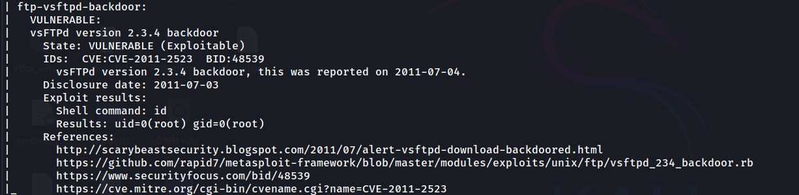
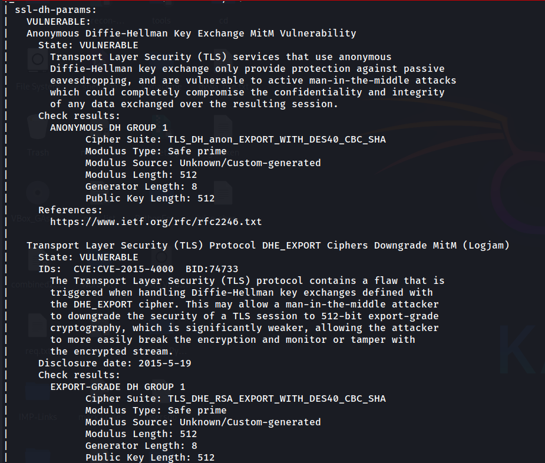
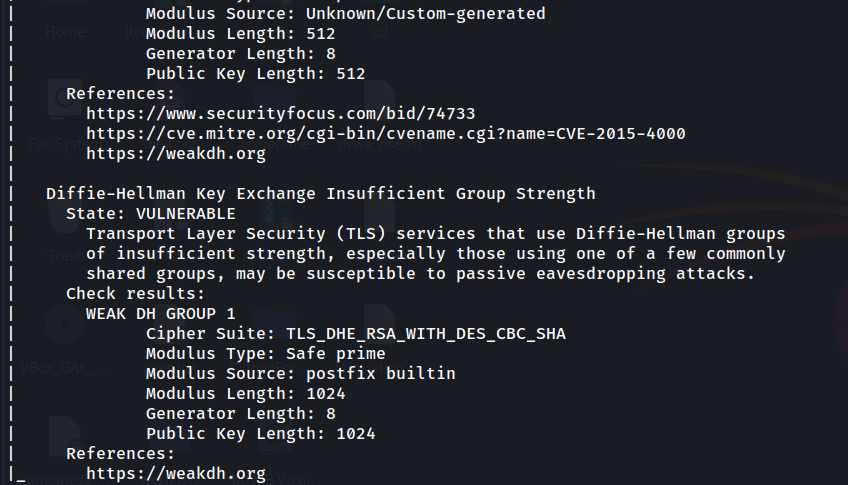

# Mini Task: NSE Scan on Metasploitable

> **Note:** The full NSE scan output has been saved in `metasploitable_nse.txt`.

---

## 1. vsFTPd 2.3.4 Backdoor (Port 21)

**Description:**  
vsFTPd version 2.3.4 has a **backdoor vulnerability** that allows remote attackers to execute commands as root.  

**Status:** VULNERABLE (Exploitable)  
**CVE Reference:** [CVE-2011-2523](https://cve.mitre.org/cgi-bin/cvename.cgi?name=CVE-2011-2523)  

**Screenshot:**  

---

## 2. SSL POODLE Vulnerability (Port 25 / SMTP)
 
**Description:**  
The server supports **SSL 3.0**, which is susceptible to the **POODLE attack**. Attackers can exploit CBC padding flaws to obtain sensitive data.  

**Status:** VULNERABLE  
**CVE Reference:** [CVE-2014-3566](https://cve.mitre.org/cgi-bin/cvename.cgi?name=CVE-2014-3566)  

**Screenshot:**  

---

## 3️. Anonymous Diffie-Hellman / Logjam (Port 25 / SMTP)

**Description:**  
The SMTP server allows **anonymous Diffie-Hellman key exchange** and uses **weak export-grade ciphers**, making it vulnerable to **Man-in-the-Middle (MitM) attacks**.  

**Status:** VULNERABLE  
**CVE Reference:** [CVE-2015-4000](https://cve.mitre.org/cgi-bin/cvename.cgi?name=CVE-2015-4000)  

**Screenshot:**  

---

The Nmap NSE scan successfully identified multiple **real vulnerabilities** in the Metasploitable VM. Each of the vulnerabilities has an associated **CVE** and can be further explored in penetration testing exercises.  

> **Full Scan Report:** Available in `metasploitable_nse.txt`.
